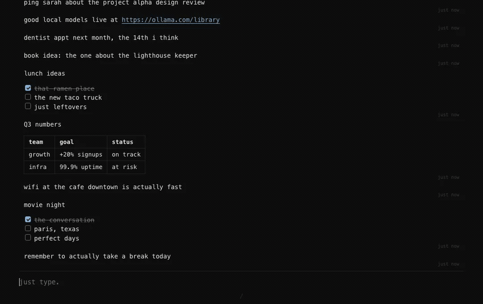

# Blurt

**just type. it remembers.**



You just type. One endless stream, newest at the bottom, no folders, no tags, no
"where did I put that." The twist: as you write, Blurt is quietly reading your
own past notes back to itself, and the moment you start writing something you
already wrote once, it surfaces the old one right above your cursor. Update it,
or ignore it. Your call. It all runs on your machine. Nothing leaves.

It is semantic, not search-by-keyword. Type "where did I put the extra key" and it
pulls up the note that says "spare key is under the blue flowerpot." You never typed
the same words. It just gets it.

## Why I built this

I am a scratchpad person. Always have been. Every note app I have ever used ends up
the same way: one giant dump, everything thrown in as it happens. Meeting notes
sitting next to a gate code sitting next to someone's phone number sitting next to a
half-finished thought I had at 2am. No folders, no tags, no going back to organize
anything. Just a single running stream of everything my brain decided was worth
keeping.

The problem was never writing things down. That part I had figured out. The problem
was always later. Scrambling through old entries trying to remember the exact word I
used. Finding three versions of the same phone number and having no idea which one
was current. Knowing I wrote something down somewhere and still spending ten minutes
looking for it like an idiot.

I built Blurt because I got tired of that. It looks like the dumbest notepad you have
ever seen, and that is entirely intentional. The intelligence is underneath, invisible
until you need it. It runs on your machine, it costs nothing to operate, and it never
asks you to change how you think.

If this is how your brain works too, it is yours. And if you build something cool on
top of it, I would genuinely love to know.

## What makes it not annoying

- **The peek.** It surfaces what you already wrote, as you write. Quiet until
  useful, then exactly useful.
- **Capture is dumb fast.** Type, hit Enter, saved. Saving never waits on
  anything. No spinners, no "syncing."
- **It is yours, completely.** Local SQLite plus local embeddings (Ollama). No
  cloud, no account, no API key, no telemetry. The internet is not invited.
- **It is just text.** Markdown in, Markdown out. A plain `scratchpad.md` stays
  in sync next to your data at all times.
- **Keyboard first.** A `/` menu for formatting (to-do, headings, code, all of
  it), lists that continue themselves, URLs that auto-link. No toolbars.

## What it needs

Blurt does its semantic search locally through Ollama, so the thinking happens on
your machine, not on a server. In practice that means any reasonably modern
computer: roughly 8GB of RAM or more, on an Apple Silicon or Intel Mac, Linux, or
Windows. The embedding model (`nomic-embed-text`) is small, about 270MB, and light.
No GPU required. A GPU only speeds up indexing a large backlog; for everyday typing
you will not notice it working.

Built and tested on a Mac. Linux should be fine too. Windows is untested so far: the
core is cross-platform and the window should open, but the desktop niceties (adding
itself to your apps, the native menu) are Mac-only for now. If you want to try it on
Windows, go for it, and a pull request that makes it feel native there is welcome.

## Install

Blurt needs two free things on your machine first: **Ollama** (its local AI brain)
and **Python 3.11+**.

**1. Ollama.** Download it from [ollama.com/download](https://ollama.com/download)
(or `brew install ollama` if you use Homebrew), then open it once so it is running.

**2. Blurt**, the easy way, with [pipx](https://pipx.pypa.io):

```bash
pipx install git+https://github.com/rbsriram/blurt
blurt
```

No `pipx`? Install it once, then run the two lines above in a new terminal:

```bash
brew install pipx && pipx ensurepath                          # macOS with Homebrew
# or, without Homebrew:
python3 -m pip install --user pipx && python3 -m pipx ensurepath
```

`blurt` opens it in its own desktop window, and on macOS it adds itself to your
Applications, so after the first run you just double-click it like any app. The first
run also pulls the embedding model (about 270MB, once). That is it.

Other ways to install:

```bash
pip install --user git+https://github.com/rbsriram/blurt && blurt   # plain pip

# or a one-line installer (it just downloads a release and writes a launcher,
# no build step; read it first, that is why it is short):
curl -fsSL https://raw.githubusercontent.com/rbsriram/blurt/main/install.sh | bash

# or from a clone:
git clone https://github.com/rbsriram/blurt && cd blurt && ./setup.sh
```

Your notes live in `~/.local/share/blurt/` (a SQLite file and a plain
`scratchpad.md`). Press `?` in the app for the keys.

## The keys (short version)

| Key | Does |
| --- | --- |
| `Enter` | save the note |
| `Shift+Enter` | new line (and continues a list) |
| `/` | formatting menu, at the start of a line |
| `Up` | peek at matching notes, then edit one in place |
| `Cmd/Ctrl+F` | search |
| `Cmd/Ctrl+Z` | undo the last thing |
| `?` | the full cheatsheet |

## Under the hood (for the curious)

SQLite holds the notes and their embeddings. A background worker embeds new notes
without ever slowing down your typing. Search is hybrid: exact text matches the
instant you save, semantic catches up a beat later. The vector index only ever
holds your live notes, so deleting one removes it from search for free. The server
binds to localhost, and that is the security model: it is on your computer, and it
stays there. The full threat model, including one destructive test-only endpoint
that stays disabled unless you opt in, is written up in
[`docs/SECURITY.md`](docs/SECURITY.md).

Want the full map? See [`docs/ARCHITECTURE.md`](docs/ARCHITECTURE.md). Want every
place the plan and the build disagreed, and why? See
[`docs/DECISIONS.md`](docs/DECISIONS.md). It is an honest log.

## Contributing

Issues and pull requests are welcome. See
[`.github/CONTRIBUTING.md`](.github/CONTRIBUTING.md) to get set up. The rule of
thumb: capture stays instant, the UI stays quiet, and nothing phones home.

## Built by

Sriram ([@rbsriram](https://github.com/rbsriram)) and
[Claude Code](https://claude.com/claude-code). Sriram had the idea and made every
call. Claude did a lot of the typing. Good team.

MIT licensed. Take it, fork it, make it weirder.
